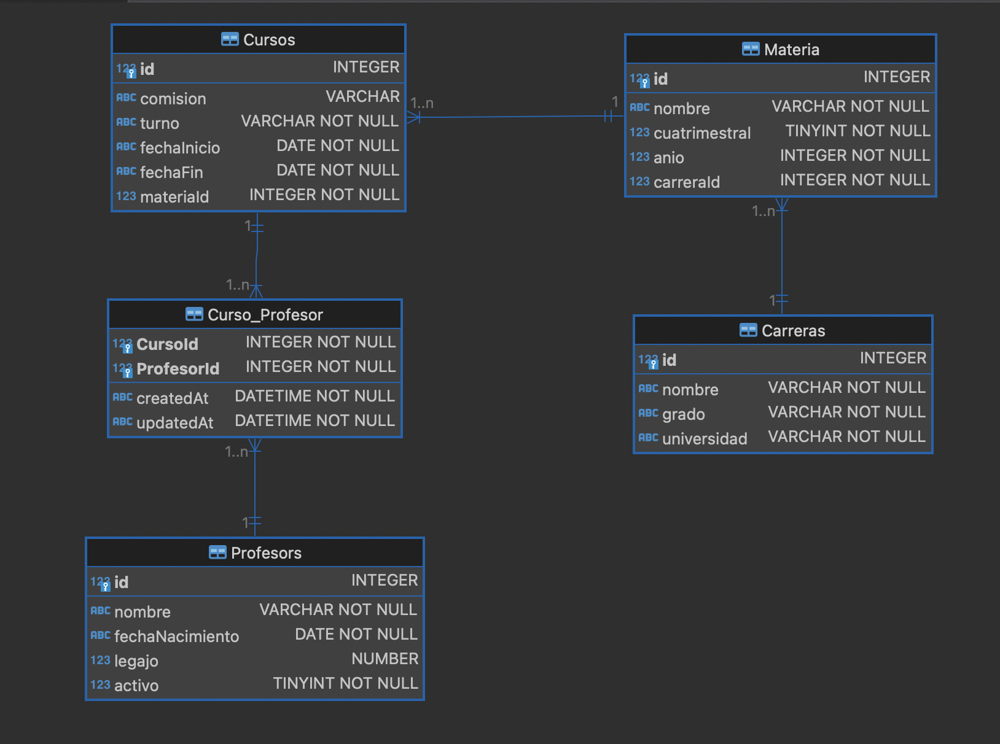

[](https://classroom.github.com/a/wCJ4UtrS)
# Estrategias de Persistencia - TP 2024

Este trabajo práctico tiene como objetivo principal que los alumnos adquieran experiencia práctica en la implementación de asociaciones 1 a N y N a M en el contexto de una API REST utilizando un ORM (Object-relational mapping).

- Asociaciones 1 a N y N a M:
Las asociaciones 1 a N y N a M son conceptos fundamentales en el diseño de bases de datos relacionales. En una asociación 1 a N, un registro de una tabla está asociado con uno o más registros de otra tabla. Por otro lado, en una asociación N a M, varios registros de una tabla están asociados con varios registros de otra tabla a través de una tabla de unión intermedia.

- API REST:
Una API REST (Representational State Transfer) es un conjunto de reglas y convenciones para la creación de servicios web que permiten la comunicación entre sistemas. En este trabajo práctico, utilizaremos una API REST para exponer recursos y permitir operaciones CRUD (Create, Read, Update, Delete) sobre estos recursos.

- Enfoque Práctico:
Los alumnos implementarán las asociaciones mencionadas anteriormente en el contexto de una API REST utilizando un ORM específico,Sequelize. Se espera que los alumnos comprendan cómo definir modelos, establecer relaciones entre ellos y utilizar las capacidades del ORM para interactuar con la base de datos.

- Criterios de Evaluación:
Se evaluará la precisión y completitud en la implementación de las asociaciones en la API REST, así como la funcionalidad completa del CRUD para los recursos expuestos por la API.

## Modelo Relacional a implementar

Basandose en el siguiente diagrama de entidad-relacion (DER) deberán generar los modelos y la asociaciones en Sequelize para que la API pueda interacturar con la base de datos a través de los Modelos.



### Descripción del modelo DER
- Una **Carrera** puede tener muchas materias.
- Una **Materia** puede se puede dictar en muchos cursos.
- Un **Curso** puede ser dictado por muchos profesores.
- Un **Profesor** puede dictar muchos cursos.

### Base de datos
El motor de base de datos a utilizar podra ser elegido por los alumnos. La recomendacion es utilizar sqlite para pruebas simple y luego probar con otro motor de base de datos tipo MySql o Postgres.

### Intalacion de dependencias
Debera contar con las dependencias de produccion y desarrollo necesarias de un proyecto node. Por ejemplo:

```npm i sequelize sqlite3```

```npm i -D sequelize-cli``` 

### Tips - Comandos utililes
- Inicializar un proyecto sequelize 

```npx sequelize-cli init```
- Generar un modelos simple


```npx sequelize-cli model:generate --name Carrera --attributes "nombre:string,grado:string,universidad:string"```

## API
Implementar la API utilizando el framework express en el entorde de ejecucion de un poryecto NodeJs. Organizar el código en rutas, controlers y middleware utilizando la separación por recurso. A continuación se detallan los endpoinds que deberán estar disponbiles en la API.

|Verbo|Recurso|Status code|Descripción|
|-----|-------|-----------|-----------|
|Get|/carreras|200|Obtener todas la carreras|
|Get|/carreras/:id|200, 404|Obtener una carrera en particular|
|Post|/carreras|201 , 400|Crear una Carrera|
|Post|/carreras/:id/materia|201, 404, 400|Crea un materia dentro de una carrera|
|Get|/carreras/:id/materias|200, 404| Obtener todas la materias de una Carrera
|Get|/materias|200|Obtener todas las materias|
|Get|/materias/:id|200, 404|Obtener una materia en particular|
|Delete|/materias/:id|200, 404, 500|Borra una materia en particular|
|Post|/materias/:id/curso|201, 404, 400|Crea un Curso para la la Materia|
|Get|/materias/:id/cursos|200, 404| Obtener los Curso de la Materia
|Get|/cursos|200|Obtener todos los cursos|
|Get|/cursos/:id|200, 404|Obtener un curso en particular|
|Delete|/cursos/:id|200, 404, 500|Borra un curso en particular|
|Put|/cursos/:id|200, 404|Modificar los datos de un curso particular
|Get|/profesores|200|Obtener todos los profesores
|Get|/profesores/:id|200, 404|Obtener un profesor en particular
|Post|/profesores|201, 400|Crear un profesor
|Put|/profesores/:id|200, 404|Modificar lo datos de un profesor
|Delete|/profesores/:id|200, 404, 500|Borrar un profesor
|Post|/cursos/:id/profesores|201, 404, 400|Crea la asociacion curso con 1 o N profesores
|Get|/cursos/:id/profesores|202, 404|Obtener todos los profesores de un Curso
|Get|/profesores/:id/cursos|200, 400|Obtener todos los curso que tiene un profesro

## Ejemplos
A modo de ejemplo se muestra el resultado de algunas respuesta de los endpoind detallado en la tabla de la sección anterior.

Recurso:  **_/profesores/1/cursos_**

Obtiene los datos del profesor registrado con el id 1, con todos los cursos que tiene asociado con sus correspondientes atributos y de cada curso se muetra todos los datos de las materias.

```
{
    "id": 1,
    "nombre": "Gerardo",
    "fechaNacimiento": "1975-08-12",
    "legajo": 24911146,
    "activo": true,
    "cursos": [
        {
            "id": 1,
            "comision": "N1",
            "turno": "Noche",
            "fechaInicio": "2024-03-14",
            "fechaFin": "2024-06-29",
            "materiaId": 1,
            "materia": {
                "id": 1,
                "nombre": "Objetos 1",
                "cuatrimestral": true,
                "anio": 1,
                "carreraId": 1
            }
        },
        {
            "id": 2,
            "comision": "M1",
            "turno": "Mañana",
            "fechaInicio": "2024-03-14",
            "fechaFin": "2024-06-29",
            "materiaId": 1,
            "materia": {
                "id": 1,
                "nombre": "Objetos 1",
                "cuatrimestral": true,
                "anio": 1,
                "carreraId": 1
            }
        },
        {
            "id": 3,
            "comision": "N1",
            "turno": "Noche",
            "fechaInicio": "2024-03-14",
            "fechaFin": "2024-06-29",
            "materiaId": 2,
            "materia": {
                "id": 2,
                "nombre": "Estrategias Persistencia",
                "cuatrimestral": true,
                "anio": 1,
                "carreraId": 1
            }
        }
    ]
}
```

Recurso: **_/cursos/1/profesores_**

Obtiene los datos del curso registrado con el id 1, con todos los profesores que tiene asociado con sus correspondientes atributos y de cada profesor se muetra todos los datos del mismo.

```
{
    "id": 1,
    "comision": "N1",
    "turno": "Noche",
    "fechaInicio": "2024-03-14",
    "fechaFin": "2024-06-29",
    "materiaId": 1,
    "materia": {
        "id": 1,
        "nombre": "Objetos 1",
        "cuatrimestral": true,
        "anio": 1,
        "carreraId": 1
    },
    "profesores": [
        {
            "id": 1,
            "nombre": "Gerardo",
            "fechaNacimiento": "1975-08-12",
            "legajo": 24911146,
            "activo": true
        },
        {
            "id": 2,
            "nombre": "Florencia",
            "fechaNacimiento": "1974-03-29",
            "legajo": 24535032,
            "activo": true
        }
    ]
}
```

## Consideraciones Finales sobre la Entrega

- El equipo debera entegar un repositorio de github con todas las instrucciones necesarias para correr la api. 
- Debernán  detallar los commandos necesarios para la instalacion y ejecucion de la api.
- Dentro del Readme.md deberá tener una imagen del diagrama entidad-relacion
- El puerto de listener deberá ser configurable por variable de entorno
- La entega debe soportar cambiar la configuración del motor de base de datos de forma simple en funcion de probar con distintos motores.

